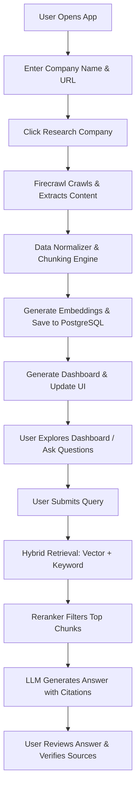
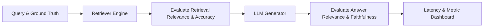

# Product Requirements Document (PRD): Company Research RAG

## 1. Product Overview

The **Company Research RAG** is a specialized, end-to-end web application that automates the collection, processing, indexing, and retrieval of public company information. By inputting only a company's name and homepage URL, users generate a custom, company-specific Retrieval-Augmented Generation (RAG) knowledge base. 

Unlike generic "chat with PDF" or search-engine-wrapper applications, this product automates deep, target-specific web crawling, cleans and chunk-structures page content, indexes semantic and lexical information in a relational database using `pgvector`, and applies a multi-stage retrieval, hybrid search, and reranking pipeline to answer questions with verifiable, clickable citations.

---

## 2. Problem Statement

Conducting thorough research on a company—whether for sales prospecting, job interview preparation, investment due diligence, or competitor analysis—is traditionally a tedious, manual process. Professionals must browse multiple web pages (About Us, Products, Careers, Engineering Blog, Press Releases), copy-paste text, and synthesize insights manually.

Existing AI solutions either:
1. **Lack context depth**: Relying on their pre-trained weights, leading to outdated information, hallucinations, or lack of company-specific detail.
2. **Require manual parsing**: Requiring the user to find, download, and upload individual PDFs or manually supply every sub-page URL.
3. **Offer poor attribution**: Providing answers without verifiable sources, making it impossible to check if information is accurate or current.

---

## 3. Product Goals

- **Zero-Configuration Ingestion**: Allow users to trigger a comprehensive crawl and index of an entire company website using only the root domain URL.
- **Factually Grounded Q&A**: Provide a chat interface that answers questions using *only* retrieved sources, eliminating hallucinations.
- **Source Transparency**: Ensure every factual statement is backed by clickable, precise citations showing the source URL, page title, and the exact text snippet.
- **Quantifiable RAG Quality**: Include a built-in evaluation framework to measure and compare retrieval, reranking, and generation configurations.
- **Architectural Modularity**: Build a decoupled, provider-independent codebase where embeddings, rerankers, database targets, and LLMs can be swapped out easily.

---

## 4. Target Users

| User Persona | Primary Use Case | Key Pain Points Addressed |
| :--- | :--- | :--- |
| **Job Candidates** | Preparing for technical and cultural interviews. | Saves hours of browsing job listings, engineering blogs, and team structures to find required stack/skills. |
| **Sales & Business Development (BDRs)** | Researching prospects to draft highly targeted pitch decks. | Synthesizes product offerings, target verticals, and locations instantly. |
| **Investment Analysts** | Evaluating startup or competitor capabilities and hiring patterns. | Extracts structured intelligence from company blogs, team pages, and products. |

---

## 5. User Journeys & Core Flows



### Flow 1: Setup & Ingestion
1. The user navigates to the application and is presented with a clean, modern landing interface.
2. The user inputs the **Company Name** (e.g., `Acme Corp`) and the **Website URL** (e.g., `https://acme.com`).
3. Clicking **Research Company** transitions the page to an active progress state.
4. The system starts a background job using Firecrawl. The UI displays real-time logs (e.g., "Crawling `/about`...", "Indexed 12 pages", "Found duplicate `/products/old` - skipping").
5. Once complete, the system redirects the user to the **Research Dashboard**.

### Flow 2: Exploration & Dashboard Consumption
1. The user lands on a visual dashboard divided into structured cards: Overview, Products/Services, Tech Stack, Careers, and Locations.
2. Clicking on the **Sources** tab displays a table of all crawled pages, titles, crawl status, chunk counts, and original URLs.
3. The dashboard allows users to quickly scan synthesized summaries grounded directly in the crawled content.

### Flow 3: Interactive Q&A
1. The user types a query: "What coding languages are required for their software engineering roles?"
2. The backend performs hybrid search over the stored chunks for `Acme Corp`.
3. The top 20 candidate chunks are retrieved, then filtered down to the top 5 by the reranking model.
4. The LLM receives the prompt with the top 5 chunks and constructs a response.
5. The UI renders the response with superscript citation numbers (e.g., `[1]`, `[2]`).
6. Clicking a citation opens a side drawer showing the source page title, URL, section, and the raw text chunk used to generate that part of the answer, with a link to open the original page in a new tab.

---

## 6. Functional Requirements

### 6.1 Ingestion & Crawling (Firecrawl Layer)
- **Domain Restricted Crawling**: The crawler must restrict traversal strictly to the user-supplied domain and subdomains. It must never follow external links.
- **Priority Crawling Rules**: The system must automatically target and prioritize URLs containing high-value keywords:
  - `/about`, `/company`, `/team` (Overview)
  - `/products`, `/services`, `/solutions` (Products)
  - `/careers`, `/jobs`, `/join` (Hiring)
  - `/technology`, `/engineering`, `/blog` (Tech Stack)
  - `/contact`, `/locations` (Locations)
- **Metadata Capture**: For every successfully fetched page, the system must record:
  - `url` (Canonicalized URL string)
  - `page_title` (HTML title tag content)
  - `source_type` (Determined from URL path structure, e.g., "careers", "blog", "product")
  - `retrieval_timestamp` (ISO UTC format)
- **Ingestion Fail-safes**: The ingestion layer must:
  - Skip non-HTML files (PDFs, ZIPs, images) unless explicitly requested.
  - Dedup identical content based on cryptographic hashing of the cleaned text.
  - Implement basic rate-limiting retries (backoff) when hitting `429 Too Many Requests`.
  - Handle JavaScript-rendered sites gracefully using Firecrawl’s dynamic page rendering capabilities.

### 6.2 Separation of Ingestion and RAG
- **Architectural Boundary**: The crawling and ingestion phase must be fully decoupled from the RAG indexing and embedding phase.
- **Persistence of Raw Ingests**: Raw crawled documents (HTML or markdown payloads) must be stored in a landing table or local cache before chunking. If the embedding model or chunking strategy changes, the system should re-process the raw data without re-running the web crawl.

### 6.3 Content Processing & Chunking
- **HTML/Markdown Cleaning**: Strip out script tags, styles, navigation bars, footers, cookie notices, and advertisements. Keep clean, markdown-like structured text.
- **Structure-Aware Chunking**: Chunks must respect markdown header tags (`#`, `##`, `###`), list boundaries (`-`, `1.`), and paragraph breaks.
- **Chunk Constraints**:
  - Configurable chunk size (target: ~500–1000 characters).
  - Configurable overlap (target: ~100–200 characters).
- **Metadata Inheritance**: Every single text chunk must inherit the parent document's metadata (URL, title, timestamp, source type, company ID).

### 6.4 Swappable Embedding Layer
- **Provider Interface**: A unified interface wrapper must encapsulate the embedding generation.
- **Configurations**: Support multiple providers out-of-the-box (e.g., OpenAI `text-embedding-3-small`, HuggingFace local models via SentenceTransformers, or Cohere Embed). Switching embedding models must only require modifying environment variables.

### 6.5 Vector Storage (PostgreSQL + pgvector)
- **Company Separation**: Multi-tenancy is enforced at the database query level using `company_id` columns.
- **Indexing**: Support for `HNSW` (Hierarchical Navigable Small World) indices on the embedding column for high-speed similarity search.

### 6.6 Hybrid Retrieval
- **Lexical Search**: PostgreSQL Full-Text Search (`tsvector` and `tsquery`) with English stemming and stop-word filtering.
- **Semantic Search**: Cosine similarity operations on the `pgvector` column.
- **Hybrid Score Fusion**: Combine results using Reciprocal Rank Fusion (RRF) or normalized score summation.
- **Observability Hooks**: The system must provide a debug mode outputting the intermediate search scores (Cosine score, FTS rank, combined hybrid rank) for each retrieved chunk.

### 6.7 Swappable Reranking Layer
- **Reranker Pipeline**: Candidates (top 20) retrieved by the hybrid search are sent to a cross-encoder reranker model (e.g., Cohere Rerank, BGE-Reranker).
- **Filtering**: The top $N$ (default: 5) chunks with the highest reranker relevance scores are passed to the context window.
- **Modularity**: The reranker must implement a standard abstract base class so it can be disabled or swapped for another provider.

### 6.8 LLM Generation & Grounding
- **Strict Grounding Prompt**: The system prompt must instruct the LLM:
  - "Answer the user's question using ONLY the provided context blocks."
  - "If the context does not contain the answer, state that you do not have sufficient information."
  - "Do not extrapolate or invent facts about the company."
  - "Provide exact citation references matching the indices of the context blocks."
- **Model Agnosticism**: Support OpenAI, Anthropic Claude, and Google Gemini via a unified LLM connector client.

### 6.9 Citations System
- **Deterministic Mapping**: Factual answers must map directly to document chunks. 
- **Citation Model**: The citation is *not* generated by asking the LLM to write out URLs (which leads to hallucinated links). Instead, the LLM places placeholder tags (e.g., `[1]`, `[2]`) pointing to the context array index. The frontend maps `[1]` to the metadata of the 1st retrieved chunk.

### 6.10 Research Dashboard & Interactive Q&A
- **Categorized Summarization**: Upon index completion, the system automatically triggers a set of standard background queries to pre-fill the dashboard tabs:
  - **Overview**: High-level summary of company size, mission, and focus.
  - **Products / Services**: Details of key products and business lines.
  - **Technology**: Programming languages, frameworks, cloud providers, infrastructure.
  - **Careers & Hiring**: Current open roles, core skill requirements, and hiring focus.
  - **Locations**: HQ and office sites.
- **Chat Interface**: A persistent chat component allowing conversational follow-ups.

---

## 7. Non-Functional Requirements

To ensure that the application is secure, robust, performant, and easily maintained, the system must adhere to the following non-functional requirements:

- **Modularity & Separation of Concerns**: 
  The codebase must enforce strict boundaries between modules. Do not wrap the entire RAG pipeline inside a single class or function. Separate classes/modules must be used for:
  - Ingestion (Firecrawl crawl wrapper)
  - Content cleaning and normalization
  - Chunking strategies
  - Vector embedding calculation
  - DB client operations (PostgreSQL + pgvector)
  - Keyword and semantic retrieval query compilation
  - Hybrid search fusion algorithms (e.g., RRF)
  - Reranking API invocation
  - Context construction prompts
  - LLM completion generation
  - Citation matching
  - Automated evaluation runs
- **Provider Independence**:
  The system must remain model-agnostic. Embeddings, rerankers, database endpoints, and LLM backends must be swappable via configuration without modification to core application logic.
- **Observability & Traceability**:
  - The API query responses in debug mode must output a complete telemetry payload detailing latencies (retrieval, reranking, LLM, total) and scores for intermediate candidates.
  - All logs from async crawls must be retrievable for developer inspectability.
- **Maintainability & Extensibility**:
  - Code must write to abstract base classes (interfaces) for external services (Embeddings, Reranking, Generation).
  - Use Python's Type Hints throughout the backend code for IDE-level safety and clean static checks.
- **Security**:
  - The UI must never directly request external LLM APIs; all interactions must go through the FastAPI proxy.
  - Rate limiting must be gracefully caught and queued, preventing thread blocks.

---

## 8. Data Requirements

The data architecture must store and maintain metadata to guarantee source traceability. Below are the schema field expectations for both indexing and runtime processes:

### 8.1 Company Context
- `company_id`: Unique identifier representing the targeted organization.
- `company_name`: The canonical legal or marketing name.
- `website_url`: Homepage entry point.

### 8.2 Document Sources
- `source_id`: Unique identifier for each crawled page.
- `url`: The absolute canonical URL of the crawled web page.
- `page_title`: The extracted title tag content.
- `source_type`: Category identifier (e.g., "blog", "careers", "products", "about").
- `indexing_status`: Current pipeline state of the URL.
- `error_message`: Error messages captured during ingestion.
- `retrieval_timestamp`: Timestamp when the webpage crawler fetched the content.

### 8.3 Content Chunks
- `chunk_id`: Unique identifier for each individual vector fragment.
- `chunk_index`: Sequence order integer relative to the parent page.
- `section_header`: The immediate context heading from the page content.
- `chunk_text`: The actual cleaned, normalized text content (500–1000 characters).
- `embedding_vector`: High-dimensional floating-point representation of the chunk text.
- `lexical_vector`: Stemmed dictionary weights (`tsvector`) for lexical matches.
- `created_at`: Row creation timestamp.

---

## 9. RAG Architecture Requirements

To prevent RAG operations from bottlenecking, components must remain decoupled. Below is the technical breakdown of the decoupled pipeline.

```
[Web URL] 
   │
   ▼
┌──────────────────────────────────────┐
│       1. Web Ingestion Engine        │
│       (Firecrawl API Client)         │
├──────────────────────────────────────┤
│  Crawls, obeys robots.txt, returns   │
│  clean Markdown/HTML raw files.      │
└──────────────────┬───────────────────┘
                   │
                   ▼ (Persistent Raw Docs)
┌──────────────────────────────────────┐
│     2. Data Cleaning & Chunking      │
├──────────────────────────────────────┤
│  Strips noise, splits text along     │
│  structural markdown/HTML headers.  │
└──────────────────┬───────────────────┘
                   │
                   ▼ (Structured Chunks)
┌──────────────────────────────────────┐
│         3. Embeddings Engine         │
├──────────────────────────────────────┤
│  Vectorizes chunks via configurable  │
│  API (OpenAI, Gemini, Cohere, HF).   │
└──────────────────┬───────────────────┘
                   │
                   ▼ (Vectors & Metadatas)
┌──────────────────────────────────────┐
│       4. Storage (PostgreSQL)        │
├──────────────────────────────────────┤
│  Stores: Embeddings (pgvector), text, │
│  lexical indices (tsvector), metadata│
└──────────────────┬───────────────────┘
                   │
                   ├─────────────────────────────────────────┐
                   ▼ (User Query)                            ▼ (User Query)
       ┌───────────────────────┐                 ┌───────────────────────┐
       │   Semantic Vector     │                 │   Full-Text Keyword   │
       │     Search (L2/Cos)   │                 │     Search (GIN)      │
       └───────────┬───────────┘                 └───────────┬───────────┘
                   │                                         │
                   └───────────────────┬─────────────────────┘
                                       │
                                       ▼
                       ┌───────────────────────────────┐
                       │    5. Hybrid Fusion (RRF)     │
                       ├───────────────────────────────┤
                       │ Merges and ranks top chunks   │
                       └───────────────┬───────────────┘
                                       │ (Top 20 Chunks)
                                       ▼
                       ┌───────────────────────────────┐
                       │      6. Reranking Layer       │
                       ├───────────────────────────────┤
                       │ Cross-Encoder (Cohere/BGE)    │
                       └───────────────┬───────────────┘
                                       │ (Top 5 Chunks)
                                       ▼
                       ┌───────────────────────────────┐
                       │     7. LLM Prompt Engine      │
                       ├───────────────────────────────┤
                       │ Formats System Prompt +       │
                       │ Context Chunks + User Query   │
                       └───────────────┬───────────────┘
                                       │
                                       ▼
                       ┌───────────────────────────────┐
                       │        8. Generation          │
                       ├───────────────────────────────┤
                       │ LLM generates grounded answer │
                       │ with citation source bindings │
                       └───────────────────────────────┘
```

### Decoupling Rules:
1. **No Mono-classes**: Never write a single `RAGController` that runs crawls, splits text, inserts to database, and queries LLM in one execution chain.
2. **Abstract Base Interfaces**:
   - `class BaseEmbeddingProvider`: Defines `embed_text()` and `embed_documents()`.
   - `class BaseRerankerProvider`: Defines `rerank(query, chunks)`.
   - `class BaseLLMProvider`: Defines `generate_completion(prompt, context)`.
3. **Queue-driven or Async Processing**: Long-running crawl and indexing operations should run as async tasks (e.g., using FastAPI Background Tasks or Celery/Redis) to avoid HTTP timeouts.

---

## 10. Database Requirements

PostgreSQL with the `pgvector` extension will serve as the unified database engine for metadata, relational structures, semantic search vector records, and lexical full-text catalogs.

### Conceptual Data Model (No raw SQL scripts)

#### `companies` Table
- `id` (UUID, Primary Key)
- `name` (VARCHAR, Not Null)
- `website_url` (VARCHAR, Unique, Not Null)
- `created_at` (TIMESTAMP WITH TIME ZONE, Default: NOW())
- `updated_at` (TIMESTAMP WITH TIME ZONE, Default: NOW())

#### `sources` Table
- `id` (UUID, Primary Key)
- `company_id` (UUID, Foreign Key referencing `companies.id`, Cascade Delete)
- `url` (VARCHAR, Not Null)
- `title` (VARCHAR)
- `source_type` (VARCHAR, e.g., "careers", "product", "blog", "general")
- `indexing_status` (VARCHAR, e.g., "pending", "crawling", "completed", "failed")
- `error_message` (TEXT, Nullable)
- `retrieval_timestamp` (TIMESTAMP WITH TIME ZONE)
- `raw_content` (TEXT, stores raw markdown/HTML payload)
- `content_hash` (VARCHAR)

#### `chunks` Table
- `id` (UUID, Primary Key)
- `company_id` (UUID, Foreign Key referencing `companies.id`, Cascade Delete)
- `source_id` (UUID, Foreign Key referencing `sources.id`, Cascade Delete)
- `chunk_index` (INTEGER, sequence index for document ordering)
- `section_header` (VARCHAR, the nearest heading context, e.g., "### Career Openings")
- `content` (TEXT, Not Null)
- `embedding` (VECTOR, 1536 or 3072 dimensions depending on model)
- `tsv_content` (TSVECTOR, generated column for lexical full-text search)
- `created_at` (TIMESTAMP WITH TIME ZONE, Default: NOW())

### Indexing Requirements:
- **Vector Indexes**: An `HNSW` index on the `embedding` column using cosine distance operator class (`vector_cosine_ops`).
- **Lexical Indexes**: A `GIN` (Generalized Inverted Index) on the `tsv_content` column.
- **Relational Indexes**: B-Tree indexes on foreign keys: `chunks.company_id`, `chunks.source_id`, and `sources.company_id`.

---

## 11. API Requirements

The backend service built using FastAPI must expose the following endpoint structures:

### 11.1 Ingestion Endpoints

#### `POST /api/companies/research`
Triggers website crawl, extraction, and chunk embedding.
- **Request Body**:
  ```json
  {
    "company_name": "Acme Corp",
    "website_url": "https://acme.com",
    "depth_limit": 2
  }
  ```
- **Response (202 Accepted)**:
  ```json
  {
    "company_id": "8f2d658b-0c9f-4318-8f81-2bb4542d99d1",
    "status": "processing",
    "message": "Crawl job successfully queued."
  }
  ```

#### `GET /api/companies/{id}/status`
Polls the crawl/indexing status.
- **Response**:
  ```json
  {
    "company_id": "8f2d658b-0c9f-4318-8f81-2bb4542d99d1",
    "status": "indexing",
    "pages_discovered": 45,
    "pages_processed": 18,
    "pages_failed": 1
  }
  ```

### 11.2 Dashboard & Explorer Endpoints

#### `GET /api/companies/{id}/dashboard`
Retrieves pre-synthesized dashboard segments.
- **Response**:
  ```json
  {
    "overview": "Summary of Acme...",
    "products_services": "Details of Core Product...",
    "technology": "Frontend: React. Backend: Python...",
    "careers_hiring": "Hiring Senior React Engineers...",
    "locations": "HQ in San Francisco, CA.",
    "sources_count": 22
  }
  ```

#### `GET /api/companies/{id}/sources`
Retrieves details of all crawled URLs.
- **Response**:
  ```json
  [
    {
      "source_id": "278c3c1e-7b24-4f05-827c-31c36b4122d1",
      "url": "https://acme.com/about",
      "title": "About Us | Acme Corp",
      "source_type": "about",
      "status": "completed",
      "chunks_count": 8
    }
  ]
  ```

### 11.3 RAG Query & Q&A Endpoints

#### `POST /api/companies/{id}/query`
Submits a user question to run through the RAG pipeline.
- **Request Body**:
  ```json
  {
    "query": "What database are they hiring for?",
    "retrieval_mode": "hybrid", 
    "include_debug_info": true
  }
  ```
- **Response**:
  ```json
  {
    "answer": "Acme Corp is hiring engineers with experience in PostgreSQL [1] and Redis [2].",
    "citations": [
      {
        "id": 1,
        "source_id": "c3938abf-22a1-40ef-bc28-1b2c6eb84931",
        "title": "Careers at Acme Corp",
        "url": "https://acme.com/careers",
        "source_type": "careers",
        "section": "Database Engineer Opening",
        "snippet": "...seeking engineers skilled in scaling PostgreSQL clusters..."
      },
      {
        "id": 2,
        "source_id": "c3938abf-22a1-40ef-bc28-1b2c6eb84931",
        "title": "Careers at Acme Corp",
        "url": "https://acme.com/careers",
        "source_type": "careers",
        "section": "Database Engineer Opening",
        "snippet": "...and managing high-throughput cache layers using Redis..."
      }
    ],
    "debug_info": {
      "retrieval_latency_ms": 115,
      "rerank_latency_ms": 78,
      "llm_latency_ms": 845,
      "retrieved_chunks": [
        {
          "chunk_id": "550e8400-e29b-41d4-a716-446655440000",
          "similarity_score": 0.82,
          "fts_score": 12.4,
          "hybrid_score": 0.93,
          "rerank_score": 0.98,
          "text": "...seeking engineers skilled in scaling PostgreSQL clusters..."
        }
      ]
    }
  }
  ```

---

## 12. UI & Frontend Requirements

The frontend must prioritize modern styling, rich aesthetics (dark mode, glassmorphism UI elements, clean layouts), and visual cues for async processes.

### 12.1 Key UI Views

#### 1. Home / Search View
- **Aesthetic**: Premium dark mode theme using rich deep blues/slates (`#0B0F19`, `#1E293B`) paired with cyan/blue accents.
- **Fields**: A primary, centered card containing input fields for **Company Name** and **Website URL**.
- **Action**: A prominent "Research Company" button with subtle glow and hover animations.

#### 2. Progress / Logging View
- **Component**: Active during ingestion. Displays a spinning custom loader, a progress bar tracking crawled pages vs total discovered, and a real-time console log block.
- **Console Log**: Live feed printing items like:
  ```text
  [16:01:05] Crawling root URL https://acme.com ...
  [16:01:06] Discovered 14 internal links ...
  [16:01:07] Successfully indexed /about (12,410 bytes) ...
  [16:01:08] Processing /careers (Skills: Python, React, PostgreSQL) ...
  ```

#### 3. Research Dashboard View
- **Structure**: Multi-tab horizontal navigation panel:
  - **Overview**: Core profile metadata.
  - **Products & Services**: High-level value propositions.
  - **Technology**: Interactive chips representing discovered technologies (e.g., `React` `PostgreSQL` `Python` `AWS`).
  - **Careers & Skills**: Highlighted listings of required technical competencies.
  - **Sources**: A responsive table listing all crawled sources with active links to the live pages.

#### 4. Q&A / Chat Drawer Interface
- **Layout**: Splits the view or opens a side panel alongside the dashboard.
- **Display**: Chat bubble sequences.
- **Citations**: Rendered as interactive tooltips/popovers. Clicking on `[1]` scrolls open a detail card showing:
  - The URL title
  - A click-to-open button for the original web page
  - The precise paragraph used as evidence, with matching keyword terms highlighted.
- **Debug Drawer**: Toggleable panel for developers to inspect the ranking, scoring metrics, and retrieval latency for the question.

---

## 13. Security Requirements

> [!IMPORTANT]
> API keys and configuration values must be handled securely across all pipeline layers.

1. **Zero Hardcoded Secrets**: All API keys (`FIRECRAWL_API_KEY`, `OPENAI_API_KEY`, `POSTGRES_PRISMA_URL`, `COHERE_API_KEY`) must reside exclusively in `.env` files.
2. **Environment Templates**: A `.env.example` file listing all required environment keys must be committed to git, while `.env` must be excluded via `.gitignore`.
3. **Backend Proxying**: The React client must *never* talk directly to third-party APIs (Firecrawl, LLM Providers, or Rerankers). All API calls must route through the Python FastAPI server. The server must handle all authentication headers and secrets out of view of the client application.
4. **Input Sanitization**: Website URL parameters must be validated using Regex patterns on the backend to prevent SSRF (Server-Side Request Forgery) attacks or command injection attempts. Only valid HTTP/HTTPS schemes on legitimate hostnames should be queued.
5. **CORS Security**: Cross-Origin Resource Sharing (CORS) configurations in FastAPI must be locked down to the specific domain where the React app is served, disabling wildcards (`*`) in production.

---

## 14. Evaluation Requirements

To ensure RAG is solving an actual information retrieval problem, the system must implement a dedicated RAG Evaluation pipeline.



### 14.1 Evaluation Dataset Structure
A manually verified dataset must be constructed (stored as JSON) containing:
- `id` (UUID)
- `company_name` (Target company)
- `test_query` (e.g., "What cloud provider is used?")
- `ground_truth_answer` (Factual expected text statement)
- `expected_source_urls` (Array of URLs where details reside)

### 14.2 Metrics to Calculate

#### Retrieval Quality
1. **Context Relevance**: Measures how much of the retrieved context chunks are directly relevant to the user query (reducing noise).
2. **Retrieval Accuracy (Recall @ K)**: Compares the retrieved chunk URLs to the `expected_source_urls` list in the dataset.

#### Generation Quality (evaluated via LLM-as-a-judge or Ragas)
1. **Answer Faithfulness (Grounding)**: Measures if the generated answer is derived *solely* from the retrieved context. (Detects hallucinations).
2. **Answer Relevance**: Measures how directly the generated response answers the user's initial question.

#### Performance Metrics
1. **Retrieval Latency (ms)**: Time taken to retrieve vectors + run keyword query + run reciprocal rank fusion.
2. **Reranking Latency (ms)**: Time taken by the cross-encoder API call.
3. **LLM Generation Latency (ms)**: Time taken to stream or complete the final text response.
4. **Token Counts**: Retrieve and record total prompt tokens and completion tokens.

### 14.3 Mode Comparisons
The evaluation runner must support executing tests across three system profiles, comparing:
- **Vector-only Retrieval**: Basic cosine similarity check.
- **Hybrid Retrieval**: PostgreSQL vector search combined with PostgreSQL lexical search.
- **Hybrid + Reranking**: PostgreSQL hybrid search passed through the cross-encoder model.

All results must be logged and printable in tabular form to compare metrics across configurations.

---

## 15. Error Handling

| Scenario | System Impact | Expected System Behavior | UI Indication |
| :--- | :--- | :--- | :--- |
| **Invalid Company URL** | Ingestion fails immediately. | Validate URL structure using Pydantic format checks before spawning crawler. Return `422 Unprocessable Entity`. | Inline input error field: "Please supply a valid URL." |
| **Robots.txt Blocked / Crawl Failure** | Ingestion returns 0 pages. | Firecrawl flags domain blocks. The server terminates the job gracefully, logging the error, and marks source status as `failed`. | Info Card: "Crawl blocked by target site's robots.txt or rate limits. Try another domain." |
| **JavaScript Heavy / Empty Pages** | Ingestion yields empty markdown files. | Parser inspects page character count. If content is empty or below threshold (e.g., < 200 chars), page is marked as `empty` and skipped. | Toast message: "Skipping empty page `/login`." |
| **Duplicate Pages Discovered** | Bloats the vector index. | Hash-check raw parsed text. If hash matches an already processed source ID, skip embedding and vector storage phases. | Progress log: "Skipped `/home-duplicate` (Duplicate Content)." |
| **API Limit Exceeded (OpenAI / Cohere)** | Embeddings or Reranking fails. | Catch API connection exceptions. Implement 3-tier exponential backoff retries. If persistent, pause indexing, store status as `failed`, and retain raw data. | Warning panel: "System is experiencing high traffic. Indexing will resume shortly." |
| **No Retrieval Results** | RAG fails to construct context. | If hybrid search yields 0 chunks above a baseline score threshold (e.g., Cosine similarity < 0.2), bypass LLM call. | Chat Response: "I could not find any relevant information about this in the crawled company documentation." |
| **Insufficient Evidence in Context** | Prompt returns context but fails to address query. | LLM processes prompt guidelines, matches instruction, and returns standardized response. | Chat Response: "Based on the retrieved company documents, I cannot confirm this detail." |

---

## 16. MVP Scope (V1) vs. Full Roadmap (V2-V4)

### MVP Scope (V1)
The MVP establishes the complete end-to-end pipeline. A user must be able to perform a research cycle from crawl to cited answer:
1. **Ingestion**: Input company name and URL, crawl website using Firecrawl, save raw pages.
2. **Indexing**: Clean crawled documents, segment into chunks, compute vector embeddings using OpenAI or Gemini, store in PostgreSQL using `pgvector`.
3. **Retrieval**: Run basic vector similarity searches against queries.
4. **Generation & UI**: Synthesize a static dashboard with overview tabs, provide a basic QA chat console, and display clickable links to crawled pages.

### Phase 2: Search & Retrieval Optimization (V2)
- **Lexical integration**: Implement PostgreSQL Full-Text search columns and configure Reciprocal Rank Fusion (RRF) to merge vector and keyword scores.
- **Reranker integration**: Add the cross-encoder stage (Cohere Rerank) to sort candidate contexts.
- **Metadata Filters**: Enable querying filtered by specific sections (e.g., search *only* within Career pages).
- **Retrieval Debug Drawer**: Render the vector vs keyword vs rerank score analysis in the UI.

### Phase 3: RAG Evaluation Suite (V3)
- **Dataset Integration**: Support importing test questions and ground truths.
- **Automated Evaluator**: Implement standard metrics (Answer Faithfulness, Recall, Precision).
- **Metric Dashboard**: Add a visual metric dashboard charting system accuracy, latencies, and token costs across retrieval modes.

### Phase 4: Advanced Capabilities (V4)
- **Multi-Company Compare**: Compare two target companies (e.g., tech stacks or hiring trends) in side-by-side dashboards.
- **Automated Research PDF Reports**: Click to download formatted corporate intelligence PDF briefings.
- **Freshness Detection**: Schedule weekly runs to flag changed pages or new job postings on target sites.

---

## 17. Acceptance Criteria

To declare the system operational, the following criteria must be met and validated:

- [ ] **Crawling Scope**: Crawling `https://example.com` successfully discovers, parses, and persists at least 5 subpages within 2 minutes under normal network conditions.
- [ ] **RAG Isolation**: The web crawler runs as an independent module. Changing chunk parameters or embedding models can be performed using saved raw pages, without triggering a re-crawl of the website.
- [ ] **Embedding Modularity**: Swapping `EMBEDDING_PROVIDER` in `.env` from `openai` to `gemini` successfully initializes, generates vector formats, and stores data in PostgreSQL without compile errors.
- [ ] **No Hallucinated Citations**: Ask a question with answers not present in the index (e.g., "What is the CEO's favorite movie?"). The system must reply with the fallback message ("sufficient evidence not found") rather than fabricating a response or displaying placeholder citations.
- [ ] **Verifiable Citations**: Every superscript citation link in a chat response must map to a database `chunk` record matching the corresponding source ID, URL, and page title. Clicking it must display the corresponding source text snippet.
- [ ] **No Exposed Secrets**: Frontend assets bundles inspect clean of API keys, verification tokens, or development credentials.
- [ ] **Hybrid Fusion Integrity**: In hybrid mode, searches utilize a combination of vector distance metrics and PostgreSQL FTS indices, returning correct combined rankings.
- [ ] **Graceful Failures**: Entering an invalid domain format prompts the user to fix the input immediately without crashing the node server or backend processes.

